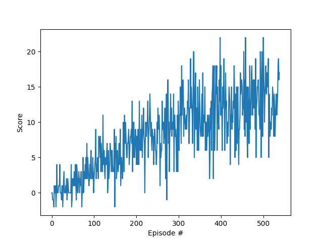

[//]: # (Image References)

[image1]: https://user-images.githubusercontent.com/10624937/42135619-d90f2f28-7d12-11e8-8823-82b970a54d7e.gif "Trained Agent"

# Project Report

### Introduction

This project implements Deep Q-Learning to solve the Navigation environment. The implementation borrows code from examples provided in the exercises.

The task is episodic, and in order to solve the environment, the agent must get an average score of +13 over 100 consecutive episodes.

### Training the Agent

The agent was trained using Deep Q-Learning with Experience Replay and Fixed Q-Targets. It utilized a neural network with three fully-connected (dense) layers interspersed with ReLU activation. Each dense layer had output size 64, except the final one, which had one node for each action.

The network was tuned by reducing MSE loss using the Adam optimizer with a learning rate of 5e-4. Training was carried out in minibatches of size 64.

A replay buffer of size 1 million was used to store experience tuples. Q values were updated using a discount factor of 0.99.

### Rewards

The image below plots the rewards per episode obtained by the agent during training. Console logs show that the agent is able to receive an average reward (over 100 episodes) of +13.01 in 439 episodes.



```commandline
Episode 100	Average Score: 1.30
Episode 200	Average Score: 5.45
Episode 300	Average Score: 8.24
Episode 400	Average Score: 11.34
Episode 500	Average Score: 12.20
Episode 539	Average Score: 13.01
Environment solved in 439 episodes!	Average Score: 13.01
```

### Improving the Agent

There are a few different improvements we can make to improve the algorithm:

- Double DQN
- Prioritized Experience Replay
- Dueling DQN